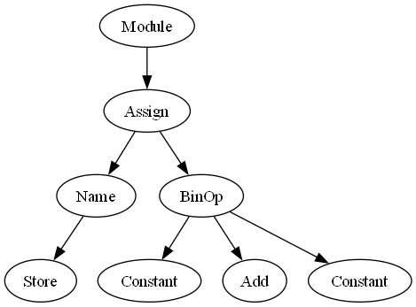

# python2ast

`python2ast` is a tool designed to convert Python code into an Abstract Syntax Tree (AST), providing a structured representation of the source code.

## Features
- Converts Python code to its corresponding AST.
- Simple and easy-to-use command-line interface.
- Useful for code analysis, visualization, and transformations.

## Installation
Ensure you have Python installed on your system. No additional dependencies are required.

## Usage
To convert a Python file to its AST, run the following command:

```sh
python converter.py <file_name.py>
```

### Example
For a Python file named `python_code.py`, use:

```sh
python converter.py python_code.py
```

### ast would be :

## Contributing
Feel free to submit issues or pull requests to enhance the functionality of this tool.

## License
This project is licensed under the MIT License. See the [LICENSE](LICENSE) file for details.

---

